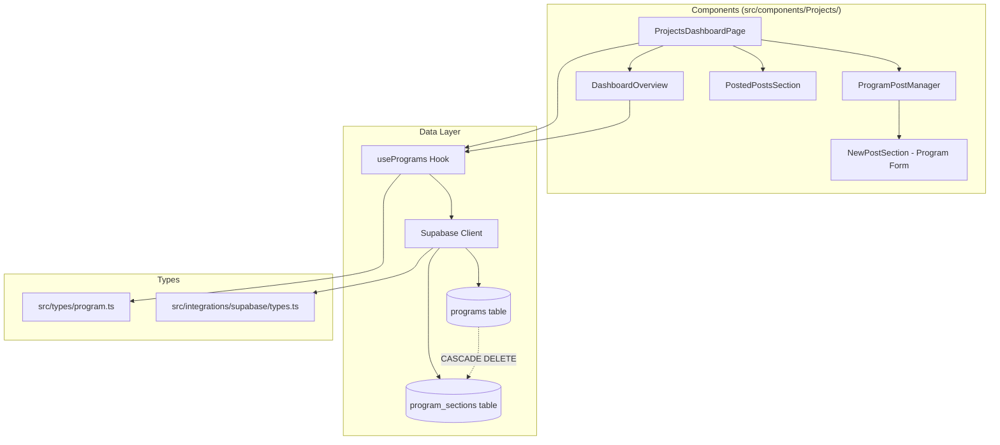
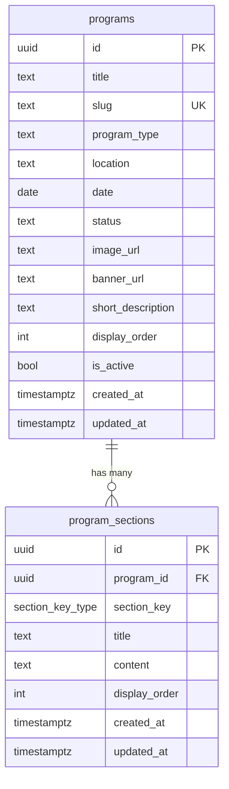

# Design Document: Programs Dashboard Integration

## Overview

This design replaces the existing Projects dashboard frontend — currently backed by the `project_posts` table with a flat data model (title, tags, content_json, SEO fields, videos_url) — with a new implementation that reads from and writes to the `programs` and `program_sections` Supabase tables.

The `programs` table stores program metadata (program_type, location, date, status, image_url, banner_url, short_description, display_order, is_active), while `program_sections` stores dynamic content keyed by a `section_key` ENUM with 14 possible values. Sections are sparse per program — not every program uses all 14 keys.

The integration replaces the `useProjects` hook and `ProjectPost` type in-place with a `usePrograms` hook and `Program`/`ProgramSection` types, updating all existing components under `src/components/Projects/` to work with the new schema while preserving the existing file structure, UI patterns (shadcn/ui), and codebase conventions.

### Key Design Decisions

1. **In-place replacement**: We replace the old types/hook rather than adding parallel ones, since the old `project_posts` table is being fully superseded.
2. **Sparse sections model**: The form allows adding/removing individual sections rather than forcing all 14 section keys, matching the seed data pattern.
3. **Single query with join**: Programs are fetched with their sections in a single Supabase query using `select('*, program_sections(*)')` to minimize round trips.
4. **No draft workflow**: The new `programs` table uses `is_active` and `status` fields instead of a separate drafts table, simplifying the data model.

## Architecture



### Data Flow

1. `ProjectsDashboardPage` calls `usePrograms()` which fetches all programs with their sections from Supabase.
2. `DashboardOverview` receives the programs array and computes metrics (total, active, this month).
3. `ProgramPostManager` orchestrates create/edit operations, delegating to `NewPostSection` for the form UI.
4. `PostedPostsSection` displays the filterable program list with view/edit/delete actions.
5. All mutations go through `usePrograms` which handles the Supabase insert/update/delete and local state updates.

## Components and Interfaces

### Type Definitions (`src/types/program.ts`)

Replaces `src/types/project.ts` with program-specific types:

```typescript
export type SectionKeyType =
  | 'introduction' | 'about' | 'modules' | 'approaches'
  | 'impact' | 'strategic_alignment' | 'conclusion' | 'header'
  | 'course_enrollment' | 'programs' | 'why' | 'cloud_kitchen'
  | 'agri_food' | 'inventions';

export interface Program {
  id: string;
  title: string;
  slug: string;
  program_type: string | null;
  location: string | null;
  date: string | null;
  status: string | null;
  image_url: string | null;
  banner_url: string | null;
  short_description: string | null;
  display_order: number;
  is_active: boolean;
  created_at: string;
  updated_at: string;
  sections: ProgramSection[];
}

export interface ProgramSection {
  id: string;
  program_id: string;
  section_key: SectionKeyType;
  title: string | null;
  content: string | null;
  display_order: number;
  created_at: string;
  updated_at: string;
}

export interface ProgramFormData {
  title: string;
  slug: string;
  program_type: string;
  location: string;
  date: string;
  status: string;
  image_url: string;
  banner_url: string;
  short_description: string;
  display_order: number;
  is_active: boolean;
  sections: ProgramSectionFormData[];
}

export interface ProgramSectionFormData {
  section_key: SectionKeyType;
  title: string;
  content: string;
}
```

### Database Types Update (`src/integrations/supabase/types.ts`)

Add `programs` and `program_sections` table definitions to the `Database` type, and add `section_key_type` to the `Enums` section. This enables type-safe Supabase queries via the typed client.

### Hook (`src/hooks/usePrograms.ts`)

```typescript
interface UseProgramsReturn {
  programs: Program[];
  loading: boolean;
  error: string | null;
  fetchPrograms: () => Promise<void>;
  createProgram: (data: ProgramFormData) => Promise<Program | null>;
  updateProgram: (id: string, data: ProgramFormData) => Promise<Program | null>;
  deleteProgram: (id: string) => Promise<boolean>;
  getProgramById: (id: string) => Promise<Program | null>;
}
```

The hook follows the same pattern as `useProjects`:
- Uses `useState` for `programs`, `loading`, `error`
- Uses `useCallback` for `fetchPrograms`
- Uses `useEffect` to fetch on mount
- Uses `useToast` for success/error notifications
- Uses `useAuth` and `useUserRole` for authorization checks on delete

**Fetch strategy**: Single query with nested select:
```typescript
supabase.from('programs')
  .select('*, program_sections(*)')
  .order('display_order', { ascending: true })
  .order('created_at', { ascending: false });
```

**Create strategy**: Insert program row, then batch-insert sections with the returned program ID.

**Update strategy**: Update program row, then upsert sections using `onConflict: 'program_id,section_key'`. Delete sections that were removed by the user.

**Delete strategy**: Delete program row; cascade handles sections automatically.

### Component Updates

| Component | Current | Updated |
|---|---|---|
| `ProjectsDashboardPage` | Uses `useProjects`, `ProjectPost` | Uses `usePrograms`, `Program` |
| `DashboardOverview` | Shows total, this month, tags metrics | Shows total, active, this month metrics; recent programs with status/type badges |
| `ProgramPostManager` | Wraps `NewPostSection` with `useProjects` CRUD | Wraps `NewPostSection` with `usePrograms` CRUD |
| `NewPostSection` | TipTap editor, SEO fields, tags, video URLs | Program metadata fields + dynamic sections area (add/remove section_key entries) |
| `PostedPostsSection` | Filters by tags, shows TipTap content excerpts | Filters by status, shows program_type/location/status badges |
| `ProjectList` | Standalone list with own `useProjects` call | Receives programs as props (like `PostedPostsSection`) |

### Form Component Design

The program form replaces the TipTap rich-text editor with a simpler sections-based approach:

- **Metadata panel** (left/main): title, slug (auto-generated), short_description, image_url, banner_url
- **Settings sidebar** (right): program_type (text input), location (text input), date (date picker), status (select: Active/Completed/In Progress), display_order (number), is_active (checkbox)
- **Sections area** (below metadata): A dynamic list where users can add sections by selecting a `section_key` from a dropdown of available keys (excluding already-added ones). Each section has a title input and content textarea. Sections can be reordered and removed.

## Data Models

### Programs Table

| Column | Type | Constraints | Description |
|---|---|---|---|
| id | UUID | PK, auto-generated | Unique identifier |
| title | TEXT | NOT NULL | Program name |
| slug | TEXT | UNIQUE, NOT NULL | URL-friendly identifier |
| program_type | TEXT | nullable | Category (e.g., 'College', 'Naan Mudhalvan', 'Government Body') |
| location | TEXT | nullable | Geographic location |
| date | DATE | nullable | Program date |
| status | TEXT | nullable | Current status (e.g., 'Active', 'Completed', 'In Progress') |
| image_url | TEXT | nullable | Thumbnail/card image |
| banner_url | TEXT | nullable | Banner/hero image |
| short_description | TEXT | nullable | Brief summary for cards/lists |
| display_order | INTEGER | DEFAULT 0 | Sort priority |
| is_active | BOOLEAN | DEFAULT true | Visibility flag |
| created_at | TIMESTAMPTZ | DEFAULT NOW() | Creation timestamp |
| updated_at | TIMESTAMPTZ | DEFAULT NOW() | Last update timestamp (auto-updated via trigger) |

### Program Sections Table

| Column | Type | Constraints | Description |
|---|---|---|---|
| id | UUID | PK, auto-generated | Unique identifier |
| program_id | UUID | FK → programs.id, NOT NULL, CASCADE DELETE | Parent program |
| section_key | section_key_type | NOT NULL, UNIQUE(program_id, section_key) | Section type identifier |
| title | TEXT | nullable | Section heading |
| content | TEXT | nullable | Section body text |
| display_order | INTEGER | DEFAULT 0 | Sort order within program |
| created_at | TIMESTAMPTZ | DEFAULT NOW() | Creation timestamp |
| updated_at | TIMESTAMPTZ | DEFAULT NOW() | Last update timestamp |

### section_key_type ENUM Values

`introduction`, `about`, `modules`, `approaches`, `impact`, `strategic_alignment`, `conclusion`, `header`, `course_enrollment`, `programs`, `why`, `cloud_kitchen`, `agri_food`, `inventions`

### Entity Relationship




## Correctness Properties

*A property is a characteristic or behavior that should hold true across all valid executions of a system — essentially, a formal statement about what the system should do. Properties serve as the bridge between human-readable specifications and machine-verifiable correctness guarantees.*

### Property 1: Fetch ordering invariant

*For any* set of programs returned by `usePrograms`, the list should be sorted by `display_order` ascending as the primary key, and by `created_at` descending as the secondary key (for programs with equal `display_order`).

**Validates: Requirements 3.1**

### Property 2: Section-program referential integrity

*For any* program returned by `usePrograms`, every section in its `sections` array should have a `program_id` equal to the program's `id`, and each `section_key` should be one of the 14 valid ENUM values.

**Validates: Requirements 3.2**

### Property 3: Create program round-trip

*For any* valid `ProgramFormData` with N sections, after calling `createProgram`, the returned program should have a title matching the input, and its sections array should contain exactly N entries with section_keys matching the input.

**Validates: Requirements 3.3**

### Property 4: Update program sections upsert

*For any* existing program and any valid set of updated section data, after calling `updateProgram`, the program's sections should match the provided section data — added sections appear, removed sections disappear, and modified sections reflect the new content.

**Validates: Requirements 3.4**

### Property 5: Delete removes program

*For any* existing program in the programs list, after calling `deleteProgram` with its ID, the program should no longer appear in the programs list.

**Validates: Requirements 3.5**

### Property 6: Slug generation produces URL-friendly strings

*For any* non-empty title string, the auto-generated slug should contain only lowercase alphanumeric characters and hyphens, should not start or end with a hyphen, and should not contain consecutive hyphens.

**Validates: Requirements 4.3**

### Property 7: Empty required fields are rejected

*For any* form state where the title is composed entirely of whitespace characters, form submission should be rejected and the programs list should remain unchanged.

**Validates: Requirements 4.5**

### Property 8: Edit form pre-population round-trip

*For any* program with sections, when loaded into the edit form, the form field values should match the program's metadata (title, slug, program_type, location, date, status, image_url, banner_url, short_description, display_order, is_active) and each existing section's title and content.

**Validates: Requirements 4.6**

### Property 9: Dashboard metrics correctness

*For any* list of programs, the total count should equal the list length, the active count should equal the number of programs where `is_active` is true, and the "this month" count should equal the number of programs whose `created_at` falls within the current calendar month.

**Validates: Requirements 5.1, 5.2, 5.3**

### Property 10: Program list filtering

*For any* search term and selected status filter applied to a list of programs, the filtered results should only include programs where the title or short_description contains the search term (case-insensitive) AND the status matches the selected filter (or all statuses if no filter is selected).

**Validates: Requirements 6.2, 6.3**

### Property 11: Program card renders required fields

*For any* program, the rendered card output should include the program's title, short_description, program_type, status, location, and date values.

**Validates: Requirements 6.1**

## Error Handling

| Scenario | Handling | User Feedback |
|---|---|---|
| Supabase fetch fails | Set `error` state, stop loading | Toast: "Failed to fetch programs" with error message |
| Create program fails | Return `null`, set `error` state | Toast: "Failed to create program" (destructive) |
| Update program fails | Return `null`, set `error` state | Toast: "Failed to update program" (destructive) |
| Delete program fails | Return `false`, set `error` state | Toast: "Failed to delete program" (destructive) |
| User not authenticated on create | Throw before Supabase call | Toast: "User not authenticated" (destructive) |
| User not authorized to delete | Check `user_id` match or `owner` role | Toast: "You can only delete your own programs" (destructive) |
| Form validation failure | Prevent submission, highlight fields | Inline validation messages next to title/slug fields |
| Duplicate slug on create/update | Supabase unique constraint error | Toast: "A program with this slug already exists" (destructive) |
| Network timeout | Supabase client handles retry | Toast with generic error message |

All error handling follows the existing `useToast` pattern used by `useProjects` and other hooks in the codebase. The hook catches errors in try/catch blocks, extracts the error message, sets the `error` state, and displays a toast notification.

## Testing Strategy

### Unit Tests

Unit tests verify specific examples, edge cases, and integration points:

- **Type conformance**: Verify that `Program`, `ProgramSection`, and `ProgramFormData` interfaces accept valid data shapes and that `SectionKeyType` includes all 14 values.
- **Slug generation edge cases**: Empty string input, strings with only special characters, strings with unicode characters, very long strings.
- **Form validation**: Empty title, whitespace-only title, missing slug, valid minimal form data.
- **Metrics computation**: Empty programs list, all active, none active, mixed dates across months.
- **Error handling**: Mock Supabase failures and verify toast notifications and error state.
- **Component rendering**: Verify DashboardOverview renders correct metric cards, PostedPostsSection renders program cards with correct fields.

### Property-Based Tests

Property-based tests verify universal properties across randomly generated inputs. Each property test maps to a correctness property defined above.

**Library**: [fast-check](https://github.com/dubzzz/fast-check) — the standard PBT library for TypeScript/JavaScript projects.

**Configuration**:
- Minimum 100 iterations per property test
- Each test tagged with a comment referencing the design property

**Tag format**: `Feature: programs-dashboard-integration, Property {number}: {property_text}`

**Property test implementations**:

| Property | Generator Strategy | Assertion |
|---|---|---|
| P1: Fetch ordering | Generate random arrays of `{display_order, created_at}` | Verify sorted order matches expected |
| P2: Section integrity | Generate programs with random sections | Verify all section.program_id === program.id and section_key ∈ ENUM |
| P3: Create round-trip | Generate random ProgramFormData | Verify returned program matches input |
| P4: Update upsert | Generate existing program + modified sections | Verify sections match after update |
| P5: Delete removes | Generate program list + random ID to delete | Verify ID absent after deletion |
| P6: Slug generation | Generate random non-empty strings | Verify slug matches `/^[a-z0-9]+(-[a-z0-9]+)*$/` |
| P7: Empty fields rejected | Generate whitespace-only strings | Verify submission rejected |
| P8: Edit pre-population | Generate random Program with sections | Verify form values match program data |
| P9: Metrics correctness | Generate random programs with varied is_active and created_at | Verify computed metrics |
| P10: Filtering | Generate programs + random search/status filter | Verify filtered results match criteria |
| P11: Card fields | Generate random Program | Verify rendered output contains all required fields |

Property tests for P1, P6, P7, P9, and P10 are pure logic tests that don't require mocking Supabase. P3, P4, P5, and P8 require mocking the Supabase client to verify the hook's behavior. P2 and P11 verify data shape invariants.
